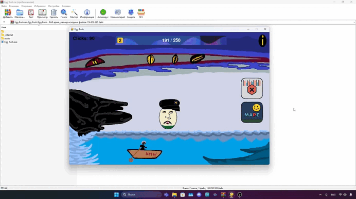

# 🥚 Egg Rush — A Mini Clicker Game with Mystery

Welcome to **Egg Rush** — a minimal yet addictive clicker game built with 🐍 Python and 💥 Pygame.  
Your mission? Tap the egg, unlock secret maps, and see what mysterious egg you'll reach at **level 666**. 👁️‍🗨️

---

## ✨ Features

- 🎮 Simple, satisfying clicker mechanics
- 🌍 Unlockable new maps and environments
- 🧠 Mystery egg at max level (can you reach it?)
- 🔊 Sound & music support
- 💾 Lightweight, fast, and portable

---

## 🚀 Quick Start (Windows)

1. 📦 Download and unzip the archive
2. 📁 Keep the `.exe` file **next to** the `assets/` folder
3. 🖱️ Double-click `Egg Rush.exe`
4. ⏫ Start tapping and climb to glory!

    


---

## 🐧 Run on Linux

### Option 1 — Run `.exe` with Wine (Quick & Dirty)

```bash
git clone https://github.com/xgcode128/Egg-Rush.git
sudo apt update
sudo apt install wine winetricks
cd Egg-Rush
wine "Egg Rush.exe"

⚠️ May have lag or audio delay — Wine magic isn't perfect.

Option 2 — Run from Source (Clean Way)

# Make sure Python 3 is installed
python3 --version

# Install Pygame
pip3 install pygame

# Run the game
python3 Project.py

💡 About the Project
This is my first serious mini-game. It’s simple, fast, and fun — designed originally for Windows, but flexible enough to run on Linux too.
I'd love to build more games in the future — maybe even in Flutter, Dart, or as a web app.

🗣️ Feedback & Ideas
Found a bug? Have a cool idea for new content? Open an issue or drop me a line.
Star the repo ⭐ if you liked it — that helps a ton!

📜 License
Licensed under Creative Commons BY-NC-ND 4.0
✔️ Free to play and share
❌ No commercial use or modifications
See the LICENSE file for full details.

Made with ❤️ by @xg_code
